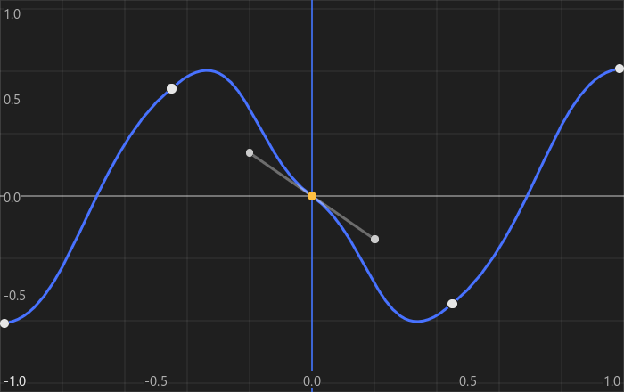

# Auik Plot Extension

`auik-ext-plot` is an extension for the [Auik](https://repos.wusikijeronii.me/app3d/auik) library that provides widgets for displaying and editing 2D curves.  
It provides an interactive curve editor with canvas navigation, curve and control point editing, selection, and customizable grid visualization.

[](./screenshots/curve_canvas.png)

## Usage

```cpp
amal::bezier_curve2 curve;
curve.points.push_back({{-1.0f, -0.5f}, {-1.0f, -0.5f}, {-0.7f, -0.5f}});
curve.points.push_back({{ 0.0f,  0.5f}, {-0.3f,  0.2f}, { 0.3f,  0.8f}});
curve.points.push_back({{ 1.0f, -0.5f}, { 0.7f, -0.5f}, { 1.0f, -0.5f}});

auto* curve_widget = auik::plot::make_control_curve(curve_id, std::move(curve));
curve_widget->set_view({{-1.0f, -1.0f}, {2.0f, 2.0f}});

auto* grid = auik::plot::make_grid(grid_id, AUIK_SIZE_FILL, 10u, amal::axis::x);
auto *canvas = auik::plot::make_curve_canvas(canvas_id, grid, curve_widget,
                                              auik::plot::CurveCanvasFlagBits::rubber_band,
                                              AUIK_SIZE_FILL
                                              );
window->add_child(canvas);
```

## Building
Auik is distributed as a CMake project and is intended to be integrated as a submodule.

### Supported compilers:
- GNU GCC
- Clang

### Supported OS:
- Linux
- Microsoft Windows

### Bundled submodules
The following dependencies are included as git submodules and must be checked out when cloning:
- [acbt](https://repos.wusikijeronii.me/app3d/acbt)
- [auik](https://repos.wusikijeronii.me/app3d/auik)

## License
This project is licensed under the  [MIT License](LICENSE).

## Contacts
For any questions or feedback, you can reach out via [email](mailto:wusikijeronii@gmail.com) or open a new issue.